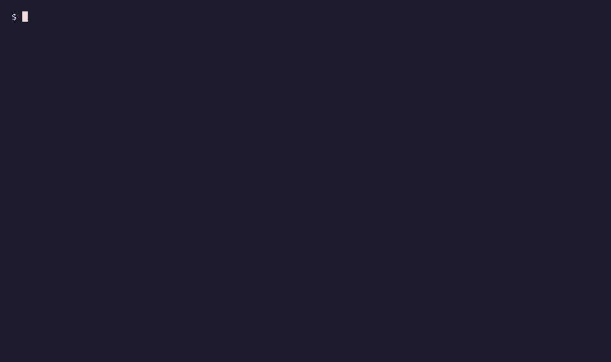
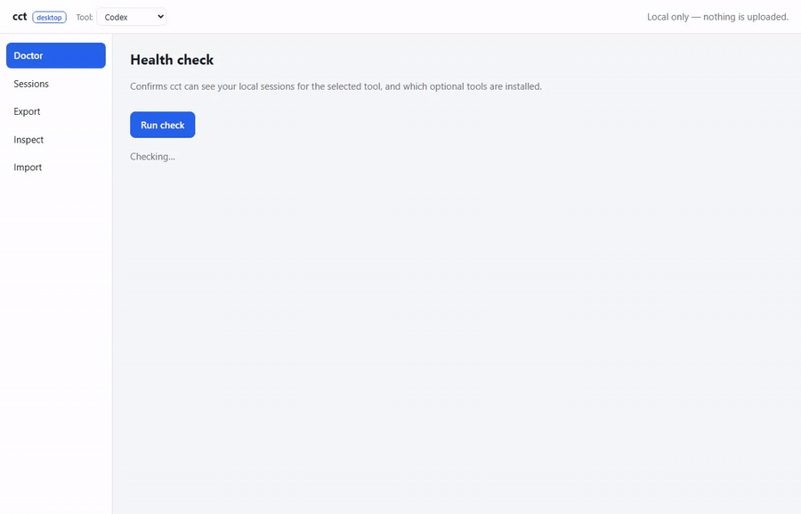
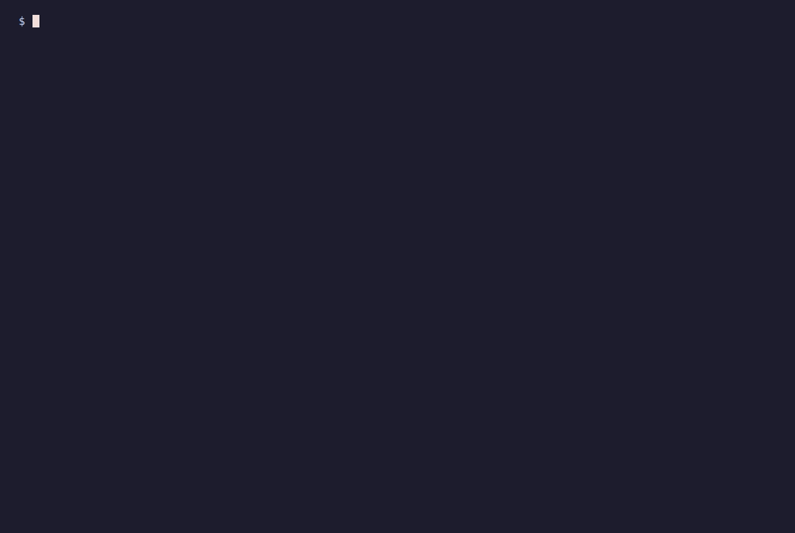
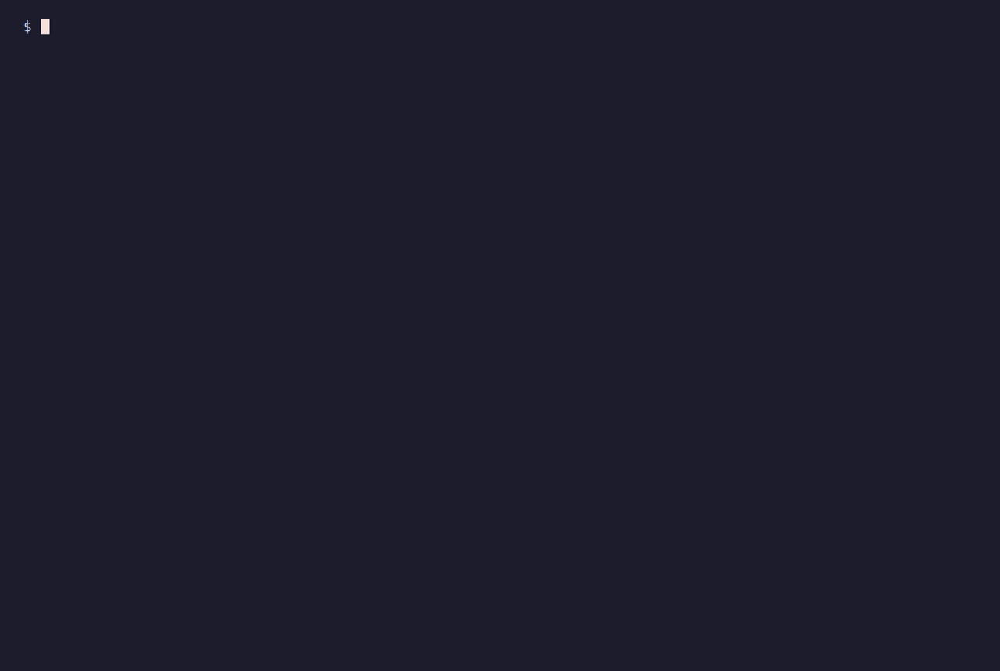
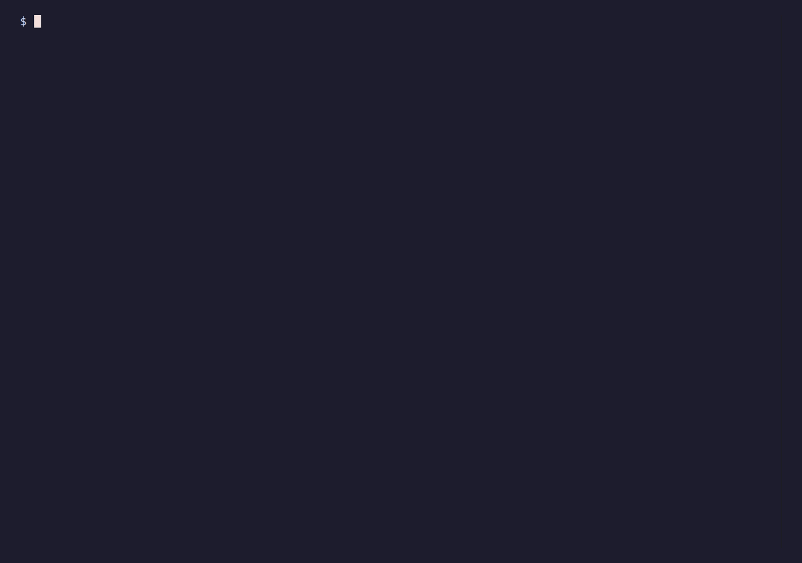

# Demo

A visual tour of `cct`. Everything below runs against throwaway demo sessions —
never a real `~/.codex` or `~/.claude`, so no real prompts, code, or paths appear.

### Move sessions between machines, incrementally

Export on one machine, sync onto the other — only what's new is appended,
nothing is re-pasted or overwritten.




### Desktop app

The same features in a local browser GUI (`cct app`).



### Cross-agent handoff

Translate Codex sessions into Claude Code (or back).


### Encryption

Encrypt a bundle to an age key; decrypt it with your private key.


### When a session changed on both machines

Replace and keep a backup, keep both copies, or redirect the project path.



### Export only what you need

By project, by single session, or by "changed since".


### Carry the matching code too

Record the project's git remote/commit, then clone it on the other side.



### Guided, if you prefer menus over flags


### Compressed sessions

Codex stores older sessions as `.jsonl.zst`; with `zstd` installed, `cct` reads
them like any other.



---

<details>
<summary>How these are recorded (for contributors)</summary>

Terminal clips are rendered with [VHS](https://github.com/charmbracelet/vhs); the
WebUI clip with [Playwright](https://playwright.dev). Nothing here touches a real
agent home — `gen_demo_home.py` writes fake Codex homes under a temp dir and the
clips point `CODEX_HOME`/`CLAUDE_HOME` at them.

- `gen_demo_home.py <base>` — fake Codex homes (`laptop/`, `pc/`) with demo
  sessions. `CCT_DEMO_BASE` overrides the project-path prefix (Windows paths for
  the WebUI clip).
- `prep.sh <scenario>` — per-tape setup: `base`, `claude`, `enc`, `conflict`,
  `mapcwd`, `git`, `zstd`.
- `*.tape` — VHS scripts (typed commands + timing).
- `record.sh` — renders all terminal GIFs in one shot.
- `webui-rec/` — the Playwright project that records `10-webui.gif`.

**Terminal clips (VHS, needs Linux + `ttyd` + `ffmpeg`; on Windows use WSL):**

```bash
wsl -d Ubuntu -- bash -lc 'bash /path/to/repo/demo/record.sh'
```

`record.sh` is self-bootstrapping (no sudo): it fetches the headless-Chromium NSS
libs locally, installs `age` if missing, and builds `cct` from source. One-time:
`vhs` (`go install github.com/charmbracelet/vhs@latest`) and a static `ttyd`
binary on `PATH`.

**WebUI clip (Playwright, runs on Windows where Chrome has its libraries):**

```powershell
cd demo/webui-rec
npm install && npx playwright install chromium
$env:CCT_HOME = "C:\path\to\cct-webui-demo\laptop\codex-home"
node record-webui.mjs            # writes out/<hash>.webm
# convert webm -> gif with ffmpeg (palette flags as in record.sh)
```

</details>
